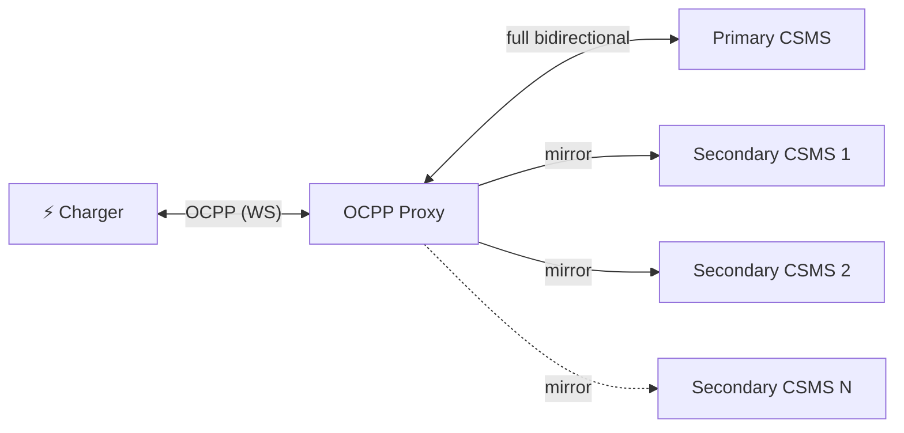

# joulo-ocpp-proxy

A lightweight **OCPP WebSocket proxy** that sits between your EV chargers and one or more CSMS backends. It forwards all traffic to a **primary CSMS** and optionally mirrors it to **secondary backends** — perfect for monitoring, analytics, or migrating between platforms without reconfiguring your chargers.

Built with Node.js and TypeScript. Supports OCPP 1.6 and 2.0.1.

## How it works



| Direction | Primary CSMS | Secondary CSMS (×N) |
|---|---|---|
| Charger → CSMS | ✅ Forwarded | ✅ Mirrored |
| CSMS → Charger | ✅ Forwarded | ❌ Ignored |

The **primary CSMS** has full control — it can send commands like `RemoteStartTransaction` back to the charger. You can attach any number of **secondary backends** that receive a read-only copy of the charger's messages (boot notifications, meter values, start/stop transactions, etc.), but their responses are never sent back to the charger. Secondary connections are best-effort — if one fails, it never affects the charger or the primary link.

### Secondary reliability

Because charger sessions can stay open for days or weeks, secondaries get a few extras so a brief network blip doesn't silently break your mirror for the rest of the session:

- **Auto-reconnect** — if a secondary disconnects, the proxy reconnects after 10s and keeps retrying until the charger session ends.
- **Keepalive ping** — the proxy sends a WebSocket ping to each secondary every 30s so idle connections aren't dropped by load balancers or CSMS timeouts.
- **Bounded queue** — while a secondary is reconnecting, up to 100 messages per secondary are buffered and replayed once it's back. Older messages are dropped first if the buffer fills.

A secondary failure never affects the charger or the primary link.

## Quick start

### Using Docker (recommended)

A pre-built image is published automatically to GitHub Container Registry on every push to `main`.

```bash
docker run -d \
  -p 9000:9000 \
  -e PRIMARY_CSMS_URL=wss://your-primary-csms.example.com/ocpp \
  -e SECONDARY_CSMS_URLS=wss://analytics.example.com/ocpp \
  ghcr.io/joulo-nl/joulo-ocpp-proxy:main
```

### Using Docker Compose

```bash
git clone https://github.com/joulo-nl/joulo-ocpp-proxy.git
cd joulo-ocpp-proxy
cp .env.example .env
# Edit .env with your CSMS URLs
docker compose up -d
```

### From source

```bash
git clone https://github.com/joulo-nl/joulo-ocpp-proxy.git
cd joulo-ocpp-proxy
npm install
npm run build
PRIMARY_CSMS_URL=wss://your-csms.example.com/ocpp npm start
```

## Configuration

All configuration is done through environment variables:

| Variable | Required | Default | Description |
|---|---|---|---|
| `PORT` | No | `9000` | Port the proxy listens on |
| `PRIMARY_CSMS_URL` | **Yes** | — | WebSocket URL of your primary CSMS |
| `SECONDARY_CSMS_URLS` | No | — | Comma-separated list of secondary CSMS URLs |
| `PRIMARY_CSMS_APPEND_CHARGE_POINT_ID` | No | `true` | `true`/`false`; when `true`, append incoming charge point ID to `PRIMARY_CSMS_URL` |
| `SECONDARY_CSMS_APPEND_CHARGE_POINT_ID` | No | `true` | `true`/`false`; when `true`, append incoming charge point ID to `SECONDARY_CSMS_URLS` |
| `LOG_LEVEL` | No | `info` | `debug`, `info`, `warn`, or `error` |

## Charger setup

Point your charger's OCPP backend URL to the proxy instead of the CSMS directly:

```
Before:  wss://your-csms.example.com/ocpp/CHARGER-001
After:   ws://proxy-host:9000/CHARGER-001
```

The proxy can append the charge point ID from the incoming URL to each upstream CSMS URL.

By default, both primary and secondary URLs append the charge point ID. For CSMS endpoints that use a fixed endpoint URL (for example `wss://fixed-csms.example.com/XXXXXXXX`), set the corresponding toggle to `false`.

If your charger connects to `ws://proxy:9000/CHARGER-001` and appending is enabled, the proxy connects to:

- `wss://your-primary-csms.example.com/ocpp/CHARGER-001`
- `wss://analytics.example.com/ocpp/CHARGER-001`

With `PRIMARY_CSMS_APPEND_CHARGE_POINT_ID=false` and `SECONDARY_CSMS_APPEND_CHARGE_POINT_ID=true`, this becomes:

- `wss://fixed-csms.example.com/XXXXXXXX`
- `wss://analytics.example.com/ocpp/CHARGER-001`

### URL patterns

The proxy accepts any of these URL patterns and extracts the last path segment as the charge point ID:

```
ws://proxy:9000/CHARGER-001
ws://proxy:9000/ocpp/CHARGER-001
ws://proxy:9000/ws/CHARGER-001
```

### Authentication

If the charger sends HTTP Basic Auth credentials, the proxy forwards the `Authorization` header to all upstream CSMS backends as-is.

### Sub-protocol negotiation

The proxy negotiates OCPP sub-protocols (`ocpp1.6`, `ocpp2.0`, `ocpp2.0.1`) between the charger and the upstream backends automatically.

## Use cases

### Multi-backend monitoring

Run your chargers against your primary platform while mirroring data to your own analytics or energy management system.

### Platform migration

During a CSMS migration, mirror traffic to the new platform and verify it processes messages correctly before switching over.

### Development & debugging

Mirror production charger traffic to a local development CSMS for testing without affecting the live system.

### Compliance & auditing

Send a copy of all OCPP messages to an audit system for regulatory compliance.

## Logging

Logs are structured JSON written to stdout/stderr:

```json
{"time":"2026-04-07T10:00:00.000Z","level":"info","tag":"proxy","msg":"proxy listening","port":9000,"primary":"wss://csms.example.com/ocpp","secondaries":[]}
{"time":"2026-04-07T10:00:01.000Z","level":"info","tag":"CHARGER-001","msg":"session started","primary":"wss://csms.example.com/ocpp","secondaries":[],"protocol":"ocpp1.6"}
{"time":"2026-04-07T10:00:01.500Z","level":"debug","tag":"CHARGER-001","msg":"charger → proxy","message":"[CALL] BootNotification (abc123)"}
```

Set `LOG_LEVEL=debug` to see individual OCPP messages.

## Building the Docker image

```bash
docker build -t joulo-ocpp-proxy .
```

The image uses a multi-stage build and runs as a non-root user (`node`).

## Contributing

Contributions are welcome! Please open an issue first to discuss what you'd like to change.

1. Fork the repository
2. Create a feature branch (`git checkout -b feature/my-feature`)
3. Commit your changes
4. Push to your branch
5. Open a Pull Request

## About

This project is maintained by [Joulo](https://joulo.nl) — a Dutch platform that helps EV owners earn rewards for charging at home with green energy. We built this proxy to solve a real-world need: connecting chargers to multiple backends without vendor lock-in.

If you're interested in smart EV charging and renewable energy, check us out at [joulo.nl](https://joulo.nl).

## License

[MIT](LICENSE) — use it however you like.
